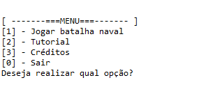
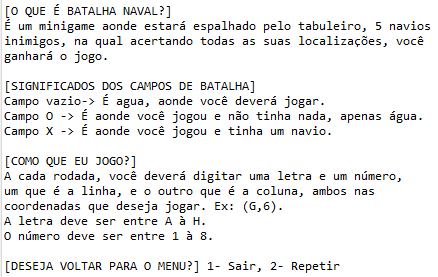
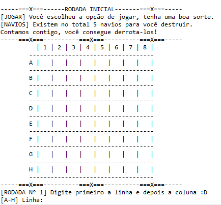
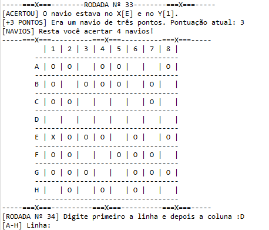
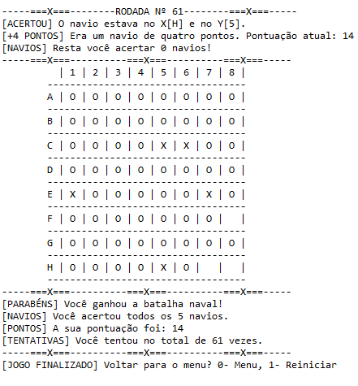

<h2 align="center">
  Batalha naval em Java
</h2>

 <a href="#-sobre-o-projeto">Sobre</a> •
 <a href="#-tecnologias">Tecnologias</a> •
 <a href="#-menu">Menu</a> • 
 <a href="#-tutorial">Tutorial</a> • 
 <a href="#-jogar">Jogar</a> •
 <a href="#-ganhar">Ganhar</a> •
 <a href="#-como-executar">Executar</a> 

## 💻 Sobre o projeto

Esse projeto foi desenvolvido para um trabalho da faculdade. É uma **batalha naval na linguagem Java** na qual o objetivo é acertar os cinco navios do tabuleiro. Eles são gerados de forma aleatório, tendo navios que valem um ponto, outros que valem dois e os que valem até três pontos. O tabuleiro vai na horizontal de A até H, enquanto na vertical de 1 a 8. Ao atirar em uma casa, se acertar será indicado com o X, em caso de erro, será um O.

---

## 🛠 Tecnologias

As seguintes ferramentas/conceitos foram usadas na construção do projeto:

-   **Java**
-   **Conceitos de POO em Java**

## 🎲 MENU

  

## 🎲 TUTORIAL

  

## 🎲 JOGAR

  
  
  

## 🚀 GANHAR

  

## 🛠 COMO EXECUTAR

Você terá que usar alguma IDE que tenha suporte a linguagem Java, como por exemplo o Eclipse.  
Com os arquivos do projeto baixado, vai em **Import projects from file system or archive** e importa o repositório.  
Ele vai carregar todas as packages e class do projeto, em seguida é só compilar e jogar!  

